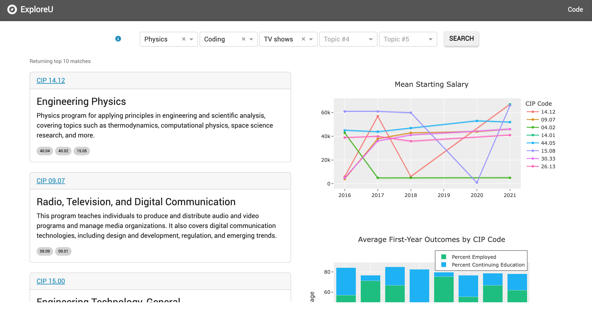
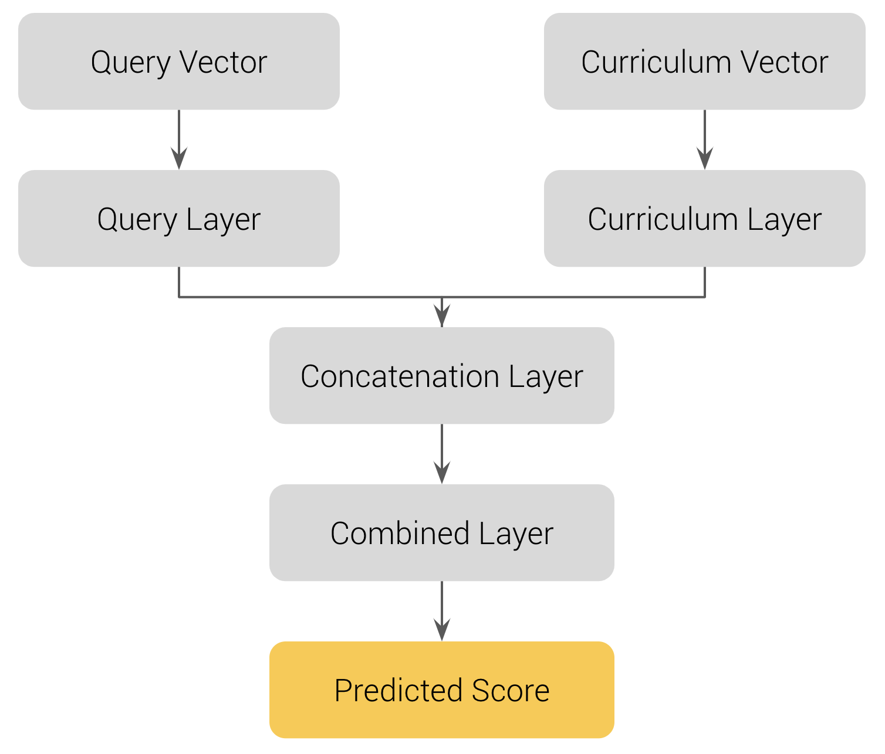
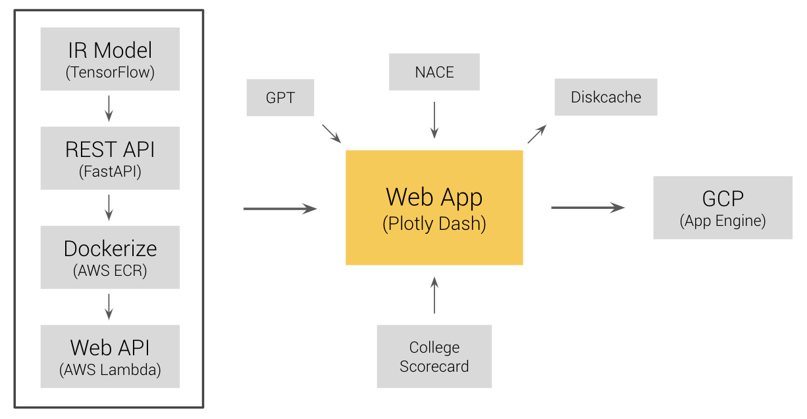

# ExploreU
Selecting a college and major is a tougher task than it needs to be. In this project, we aim to enable less stressful college decisions with more precise information. Our web app is deployed at [http://exploreu.ue.r.appspot.com/](http://exploreu.ue.r.appspot.com/).

## The Data
- [NACE](https://www.naceweb.org/job-market/graduate-outcomes/first-destination/): Career outcomes within six months of graduation by major/degree
- [College Scorecard](https://collegescorecard.ed.gov/data): Student information by institution/field of study
- Curriculum data scraped from college websites using BeautifulSoup and Selenium

## The IR System
- We used TensorFlow to build our IR system, largely referencing this TensorFlow [post](https://www.tensorflow.org/recommenders/examples/listwise_ranking)
- Test out our IR model yourself by making a GET request to this [endpoint](https://qkljp7mtn5hed6ctzqsntgbqom0tbdgm.lambda-url.us-east-1.on.aws/docs)!

  

## The Interface
Our web app is developed using Dash and deployed on Google App Engine. You can access it at our [deployed site](http://exploreu.ue.r.appspot.com/), or run it locally by cloning the repo and using the `python main.py` command in your terminal.

  

## Project Authors
- Jeffrey Cardwell
- Jacob Leslie
- Andy Chen
